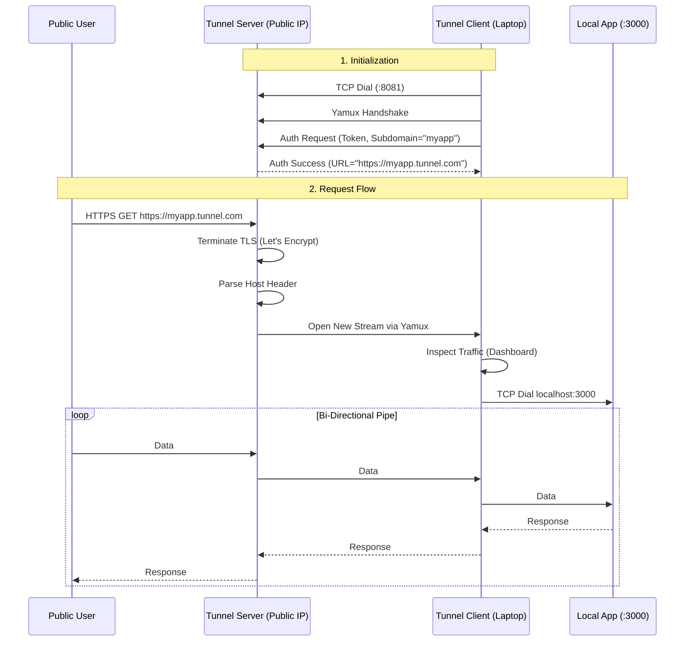

# Tunnel

A secure, high-performance tunneling service written in Go (similar to Ngrok). It allows you to expose local servers behind NATs and firewalls to the public internet over a secure tunnel.

## Features

- **HTTP & HTTPS Tunneling:** Automatic TLS termination with Let's Encrypt
- **TCP Tunneling:** Expose any TCP service (SSH, databases, etc.)
- **Multi-Tunnel Support:** Run multiple tunnels from a single config file
- **Multiplexing:** Single TCP connection handles thousands of concurrent requests
- **Inspection Dashboard:** View live requests/responses with real-time SSE updates
- **Request Replay:** Replay captured HTTP requests for debugging
- **WebSocket Support:** Automatic WebSocket passthrough
- **HTTP Keep-Alive:** Efficient connection reuse
- **Proxy Headers:** Automatic injection of X-Forwarded-For, X-Real-IP, etc.
- **Rate Limiting:** Per-subdomain rate limiting with token bucket algorithm
- **Admin API:** Server management and monitoring endpoints
- **Health Check:** Built-in health endpoint for load balancers
- **Config File:** Support for `tunnel.yaml` configuration
- **Environment Variables:** All flags can be set via `TUNNEL_*` env vars

## Architecture

The system uses **Hashicorp Yamux** to multiplex multiple logical data streams over a single TCP connection. This allows efficient bi-directional communication without the overhead of opening new TCP connections for every request.



## Installation

### Binary Releases

Download from [GitHub Releases](https://github.com/profclems/tunnel/releases):

```bash
# Linux
curl -L https://github.com/profclems/tunnel/releases/latest/download/tunnel-linux-amd64 -o tunnel

# macOS (Apple Silicon)
curl -L https://github.com/profclems/tunnel/releases/latest/download/tunnel-darwin-arm64 -o tunnel

chmod +x tunnel
sudo mv tunnel /usr/local/bin/
```

### Server Quick Install

```bash
curl -sSL https://raw.githubusercontent.com/profclems/tunnel/main/scripts/install.sh | sudo bash
```

### Build from Source

```bash
go build -o tunnel ./cmd/tunnel
```

## Quick Start

### Server

Run on a machine with a public IP:

```bash
# Basic HTTP
./tunnel server --domain "example.com" --token "mysecret"

# Production HTTPS (with Let's Encrypt)
./tunnel server --domain "example.com" --token "mysecret" --email "admin@example.com"
```

### Client - HTTP Tunnel

```bash
# Expose local port 3000
./tunnel http 3000 --server "example.com:8081" --token "mysecret" --subdomain "myapp"

# With inspection dashboard
./tunnel http 3000 --server "example.com:8081" --token "mysecret" --inspect

# With custom dashboard template
./tunnel http 3000 --server "example.com:8081" --token "mysecret" --inspect --template-path ./my-template.html
```

### Client - TCP Tunnel

```bash
# Expose local SSH (port 22) on remote port 2222
./tunnel tcp 22 --server "example.com:8081" --token "mysecret" --remote-port 2222

# Random remote port assignment
./tunnel tcp 22 --server "example.com:8081" --token "mysecret" --remote-port 0
```

### Multi-Tunnel

```bash
./tunnel start                         # uses ~/tunnel.yaml
./tunnel start --config ./tunnel.yaml  # explicit path
```

## Configuration

See [INSTALL.md](INSTALL.md) for full server/client configuration examples.

Run `tunnel <command> --help` for all available flags.

## Server APIs

### Health Check

```bash
curl http://localhost:8082/health
```

### Admin API

- `GET /api/stats` - Server statistics
- `GET /api/agents` - List connected agents
- `DELETE /api/agents/:id` - Disconnect an agent

## Development

The project is structured into three main packages:

- `protocol/`: JSON control messages for handshake
- `server/`: Public listener, TLS, agent registry, admin APIs
- `client/`: Connection to server, local forwarding, traffic inspection

### Running Tests

```bash
go test ./...
```

## Security

- Use strong tokens (`openssl rand -hex 32`)
- Enable HTTPS with `--email` for Let's Encrypt
- Enable rate limiting (`--rate-limit`)
- Don't expose admin API publicly
- Use mTLS for enterprise (`--require-agent-cert`)

## License

MIT License
